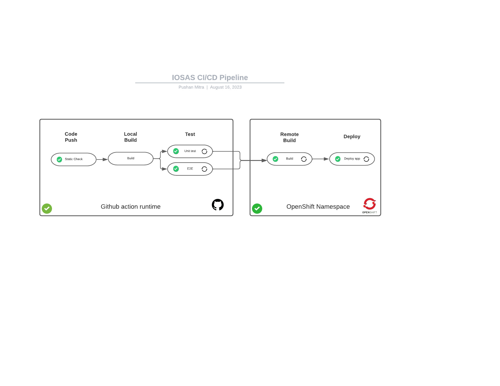

# ECC IOSAS/ISFS Middleware for Dynamics 365 Data Integration

## Introduction

Welcome to the repository of our .NET Web API, a specialized middleware application designed to streamline and optimize data integration processes for Microsoft Dynamics 365 (MS D365). This application plays a crucial role in transforming and loading data into connected MS D365 environments, facilitating seamless data management and synchronization.

### Purpose

The primary objective of this application is to act as an intermediary layer that transforms and loads data efficiently from a centralized data repository to the targeted MS D365 entity. It serves as a pivotal link in the data replication process, ensuring that any changes made to the data in the central repository are accurately reflected in the MS D365 environment. By doing so, it supports the continuity and integrity of data across systems.

### Integration with Data Replication Application

Our application's API is consumed by a Data Replication application, which is responsible for pushing any changes in the data from the centralized repository to our middleware. This process ensures that the middleware application can perform its role in transforming and loading the data into the targeted MS D365 entity effectively.

### Dynamics 365 Metadata Layer API

In addition to data transformation and loading capabilities, our application provides an MS D365 metadata layer API. This API allows for the verification of certain items within the MS D365 environment, adding an extra layer of integrity and validation to the data integration process.

### Deployment

The .NET API layer of our application is deployed on OpenShift using Deployment Configurations. This deployment strategy ensures high availability, scalability, and security for the application, enabling it to handle data integration tasks efficiently and reliably.

## Local Development Setup

To set up the middleware application for local development, please follow the steps outlined below. These steps will guide you through the process of setting up the development environment, cloning the repository, and running the application on your local machine.

### Prerequisites

- Microsoft Visual Studio 17.6 or above installed on your local machine.

### Getting Started

1. **Clone the Repository**

    Begin by cloning the repository to your local machine. Open your terminal or command prompt and run the following command:

    ```
    git clone https://github.com/bcgov/ECC-IOSAS-INSTITUTE-API
    ```

2. **Create `appsettings.json`**

    Navigate to the `{root}/SchoolInformationIntegration` directory within the cloned repository. Here, create a new file named `appsettings.json`.

3. **Configure Application Settings**

    Access the GitHub repository's web interface and navigate to the following location to find the development environment configuration:

    ```
    Settings > Security > Secrets and variables > Actions > Variables
    ```

    Look for a variable named `APP_CONFIG_DEV`. Copy the content of this variable and paste it into the `appsettings.json` file you created in the previous step.

4. **Open the Solution in Visual Studio**

    Navigate to the `{repo_root}/ECC.Institute.CRM.IntegrationAPI.sln` file. Double-click on this file to open the solution in Microsoft Visual Studio.

5. **Run the Application**

    Inside Visual Studio, initiate the application by running it. Visual Studio automates the build process and launches the application.

6. **Access Swagger UI**

    Once the application is running, Visual Studio will automatically open the default web browser and navigate to the Swagger API documentation page at:

    ```
    https://localhost:7251/swagger/index.html
    ```

    This page provides an interactive interface to test and explore the API endpoints offered by the middleware application.

## OpenShift Build and Deployment

This section outlines the steps for building and deploying the .NET Web API, which serves as a middleware for MS Dynamics 365, using OpenShift. The process utilizes a `Makefile` to automate tasks such as building the Docker image, creating certificates, and deploying the application to OpenShift. 

### Prerequisites
- Access to an OpenShift cluster with appropriate permissions.
- The `oc` CLI tool installed and configured to communicate with your OpenShift cluster.
- A clone of the repository containing the `Makefile`.

### Build the API Docker Image

1. **Set Up Environment Variables**: Ensure that your `.env` file located in the project root directory contains all the necessary environment variables. This file is automatically included and exported by the `Makefile`.

2. **Build the API Container Image**: Execute the following command to initiate the build process for the API container image. This step uses the `build-api` target in the `Makefile` and relies on the `openshift/docker-build.yml` template for configurations.

    ```
    make oc-build-api
    ```

    This command processes the Docker build template with the current git commit information and other environment variables, then starts a build in the OpenShift namespace defined by `BUILD_NAMESPACE`.

### Deploy the API

1. **Initialize API Configuration**: Before deploying, ensure that the API's configuration is properly set up in a configMap within OpenShift. This is done using the `init-api` target, which reads the `APP_CONFIG` environment variable and creates an `appsettings.json` within the API container.

    ```
    make init-api
    ```

2. **Deploy the API Container**: Use the following command to deploy the API container using the deployment configuration. This step also handles the creation of a service certificate for the .NET API server.

    ```
    make oc-deploy-api
    ```

    The deployment uses the OpenShift `api-deploy.yml` template file and updates the deployment configuration with the latest image built in the previous step.

### Accessing the Swagger UI

After successful deployment, the API will be accessible within the OpenShift cluster. You can create a port-forwarding tunnel to access the Swagger UI locally using the `d365-api-tunnel` target:

```
make d365-api-tunnel
```

This command sets up a port-forwarding tunnel to the service, allowing you to access the Swagger UI at `https://localhost:7251/swagger/index.html` (or a different port if specified).

### Clean Up and Rollout

To manage deployments, use the `oc` commands for rolling updates, scaling, or rollback as needed. For custom rollout and wait strategies, refer to the `rollout_and_wait` function defined in the `Makefile`.

### Additional Notes

- The `Makefile` includes targets for certificate creation (`api-create-certificate`), API configuration initialization (`init-api`), and deployment configuration updates (`update-dc-api`).
- Environment-specific configurations are managed using conditional statements in the `Makefile`, allowing for flexible deployments across development, test, and production environments.

By following these steps, you can build and deploy the .NET Web API middleware for MS Dynamics 365 on OpenShift, leveraging the automation provided by the `Makefile`.

## CI/CD Pipeline

This section outlines the Continuous Integration and Continuous Deployment (CI/CD) process for a web application, managed through GitHub Actions and deployed on OpenShift. The CI/CD pipeline is designed to automate the build and deployment process, ensuring that every change is seamlessly integrated and deployed to the development environment, with options for manual deployments and promotions.

### Overview of CI/CD

The CI/CD pipeline utilizes GitHub Actions to automate the building and deploying of the application. It is configured to respond to push events to specific branches and manual triggers, with each OpenShift build tagged with the Git commit SHA for traceability.

#### General Workflow Diagram



#### Workflows

##### Automatic Build and Deployment to Development Environment

- **Development Workflow**: The `dev` workflow is triggered on a push event to the `main` branch. It automatically builds and deploys the entire application to the development environment. This process is defined under `.github/workflows/dev-api.yml`.

###### Manual Build and Deployment

**API Deployment**: To manually build and deploy the API component in the development environment, the `dev-api` workflow is used. This can be triggered manually through GitHub Actions and is defined in `.github/workflows/dev-api.yml`.


###### Promotion to Target Environment

- **Promotion Workflow**: The `dev-any` workflow facilitates the promotion of a build to any target environment. It can use either a specific build tag (commit SHA) if the Git branch head points to the same commit SHA, or it can use the latest tag if the Git branch head points to a SHA whose build tag is not available. This workflow is defined under `.github/workflows/dev-any.yml` and must be triggered manually.

#### Tagging Strategy

Each build deployed to OpenShift is tagged with the Git commit SHA. This tagging strategy ensures traceability and allows for precise promotions between environments.

#### Triggering Manual Workflows

To trigger manual deployments or promotions:

1. Go to the repository on GitHub.
2. Navigate to the **Actions** tab.
3. Select the desired workflow (e.g., `dev-api`, `dev-any`).
4. Click the **Run workflow** dropdown.
5. Choose the branch where the workflow is defined.
6. Click **Run workflow** to start the process.

#### Note for CI/CD

This CI/CD pipeline automates the process of integrating, building, and deploying applications to various environments. It leverages GitHub Actions for both automatic and manual workflows, ensuring that the application remains up-to-date and stable across all development stages.


## Getting Help or Reporting an Issue

To report bugs/issues/features requests, please file an [issue](https://github.com/bcgov/ECC-IOSAS/issues).

## License

    Copyright 2020 Province of British Columbia

    Licensed under the Apache License, Version 2.0 (the "License");
    you may not use this file except in compliance with the License.
    You may obtain a copy of the License at

       http://www.apache.org/licenses/LICENSE-2.0

    Unless required by applicable law or agreed to in writing, software
    distributed under the License is distributed on an "AS IS" BASIS,
    WITHOUT WARRANTIES OR CONDITIONS OF ANY KIND, either express or implied.
    See the License for the specific language governing permissions and
    limitations under the License.
